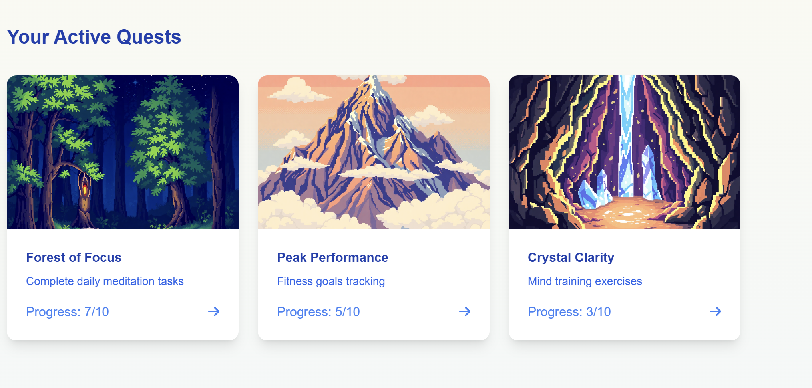

# HeroicHabits

## Deployed

[https://heroichabits-2.onrender.com](https://heroichabits.onrender.com)

## Description

Heroic Habits turns habit-building into an engaging adventure where users become the hero of their own story. By creating a personalized profile and hero avatar, users transform daily routines into quests and track their progress through a visually immersive journey. With its unique quest system and storytelling elements, Heroic Habits makes self-improvement fun and motivating.

## Table of Contents (Optional)

- [Deployed](#deployed)
- [Description](#description)
- [Installation](#installation)
- [Usage](#usage)
- [Credits](#credits)
- [License](#license)
- [Badges](#badges)
- [Contribute](#how-to-contribute)
- [Tests](#tests)

## Installation

Clone the Repository

git clone https://github.com/HassanZafar-2021/HeroicHabits.git
cd HeroicHabits
Set Up the Server

cd server
npm init -y
npm install
cp .env.example .env
Update .env with database credentials
Configure the Database

Ensure PostgreSQL is installed
Create database: psql -U postgres -c "CREATE DATABASE heroic_habits;"
Configure database settings in .env
Run migrations: npx sequelize-cli db:migrate
Verify connection with npx sequelize-cli db:seed:all (if applicable)
Set Up the Client

Navigate to project root
npm create vite@latest client --template react-ts
cd client
npm install
Configure environment variables
Run the Project

Start backend: cd ../server && npm run dev
Start frontend: cd ../client && npm run dev
Open browser and visit http://localhost:5173
Ensure backend is running at http://localhost:5000
Debug any startup issues if needed

## Usage

## Credits

Hassan Zafar - https://github.com/HassanZafar-2021
Taylor Buttanda - https://github.com/buttandataylor
Adam Liberman - https://github.com/Righteous-Penguin
Alexandria De Leon - https://github.com/ajdeleon661

## License

[MIT License](https://opensource.org/licenses/MIT)

## Badges

## Features

Personalized User Profiles
Users can create a customized profile, setting personal goals, habits, and milestones to track their progress.

Hero Avatar Customization
Users can design their own hero avatars, choosing their appearance and traits to reflect their journey and achievements.

Quest System
Daily routines are transformed into quests, offering a gamified experience where users complete tasks to level up their hero and gain rewards.

Progress Tracking
Visual progress indicators, including badges and levels, let users track their success over time and celebrate milestones.

Storytelling Integration
Each user's progress is linked to a unique narrative, with story chapters unlocking as users complete more habits, keeping the experience immersive.

Reward System
Achievements and completed quests reward users with virtual items, trophies, and status upgrades, motivating continued engagement.

Multi-Device Sync
Access and track progress seamlessly across devices, ensuring users stay connected with their journey wherever they go.

Daily/Weekly Challenges
Gamified challenges encourage users to complete new habits and maintain consistency with fresh quests every day or week.

Real-Time Notifications
Push notifications and reminders prompt users to stay on track with their quests, providing timely motivation and support.

Community Features
Social integration allows users to share their achievements, join group quests, or compete with friends on habit-building goals.

## How to Contribute

Fork & Clone Repo and make a PR with your own feature branch and push code through to open source project.

## Tests

Make a tests folder and run the command: npm run tests
